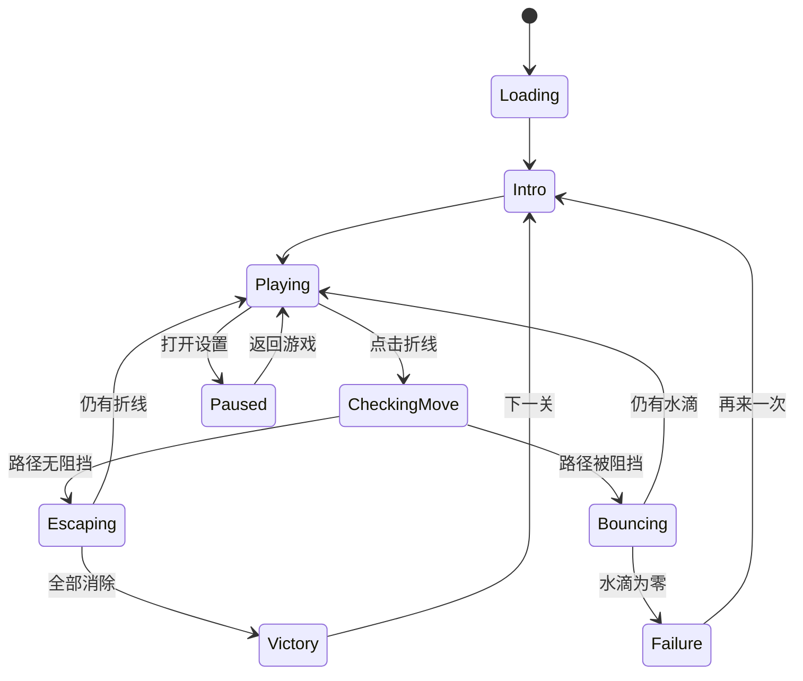
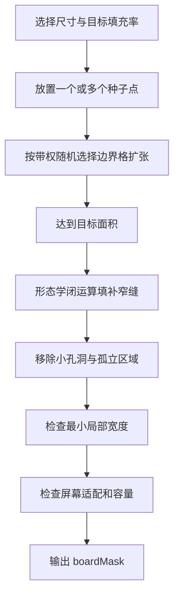

# Amaze Go 箭头消除游戏设计与实现方案

## 1. 文档目标

本文档定义一款竖屏箭头消除益智游戏的完整实现方案，包括：

- 核心玩法、胜负规则与操作反馈；
- 适配手机竖屏的界面结构；
- 任意形状点阵棋盘的生成方法；
- 折线箭头的数据结构、移动规则与渲染方法；
- 保证关卡可解、避免死锁的程序化生成算法；
- 难度计算、三星评价、提示与关卡流程；
- 美术、动画、音频、配置、测试和开发阶段规划。

本文档优先描述与具体引擎无关的规则与算法。当前项目为空目录，建议首个可玩版本使用 **TypeScript + Phaser 3** 实现为移动端网页游戏，以便快速调试程序化关卡和适配 9:16 屏幕；如果后续需要发布为原生安装包，可使用 Capacitor 封装。核心生成器与求解器应保持纯逻辑模块，未来可迁移至 Unity、Cocos Creator 或其他引擎。

## 2. 产品概述

### 2.1 核心体验

棋盘由规则间距的点阵组成。每条可点击对象是一条沿点阵连接的、不自交的直角折线，其中一个末端带有箭头。玩家点击折线后，折线按照真正的“贪吃蛇”方式逐格前进：

1. 每个逻辑动画帧，箭头沿当前方向前进一个点阵格；
2. 头部增加一个新格点，同时尾部删除一个旧格点，折线长度保持不变；
3. 箭头进入棋盘外后，越界部分不再绘制，棋盘内的尾部继续逐格缩短；
4. 若箭头下一格已被任意折线占据，则播放受阻反馈并扣除 1 滴水；
5. 若前进方向无阻挡，折线持续前进，直到所有格点都离开棋盘并消失；
6. 消除棋盘上所有折线后胜利；
7. 水滴从 3 滴开始，扣至 0 时失败。

核心思考不是规划折线自身的转向，而是判断“当前哪条折线拥有无遮挡的逃生方向”，并逐步解除其他折线的阻挡关系。

### 2.2 设计原则

- **规则秒懂** ：点击、飞出、碰撞返回三种反馈必须清晰。
- **可读优先** ：折线、间距和点击区域不能因追求高密度而难以辨认。
- **每局可证可解** ：随机关卡必须经过构造保证和求解器双重验证。
- **难而不猜** ：难度来自依赖顺序和视觉搜索，而不是不可见规则。
- **短局循环** ：单关目标时长约 20 秒到 3 分钟。
- **确定性复现** ：所有随机生成使用种子，便于分享、测试和修复。

## 3. 核心规则定义

### 3.1 坐标与点阵

棋盘采用整数格点坐标：

```text
Point = (x, y)
x ∈ [0, gridWidth - 1]
y ∈ [0, gridHeight - 1]
```

点阵背景由一组有效点 `boardMask` 定义，而不是固定矩形。只有有效点可以作为折线顶点或路径经过的位置。相邻格点仅允许上、下、左、右连接。

### 3.2 折线定义

一条折线由按顺序连接的格点组成：

```ts
type GridPoint = { x: number; y: number };

type ArrowLine = {
  id: string;
  points: GridPoint[];
  headIndex: 0 | -1;
  direction: "up" | "right" | "down" | "left";
};
```

约束如下：

- 相邻点的曼哈顿距离必须为 1；
- 路径不能重复经过同一格点；
- 折线只允许 90 度转弯，不允许斜线；
- 箭头只能位于首端或尾端；
- 箭头方向必须与端点相邻线段方向一致，并指向路径外侧；
- 单条折线不能自交，也不能自贴得过近导致视觉混淆；
- 不同折线初始占用的路径单元不能重叠。

### 3.3 占用模型

逻辑碰撞只使用格点占用模型：

- `occupiedNodes`：路径经过的格点；
- `ownerByNode`：记录每个格点由哪条折线占据；
- `clearanceMap`：用于保证不同折线之间的视觉间距。

`clearanceMap` 只服务于生成阶段的可读性评分，不参与碰撞。运行时不使用胶囊体、线段相交或像素检测；箭头每次只检查前进方向的下一个点阵位置是否存在于 `occupiedNodes`。

### 3.4 点击与移动

玩家点击折线后，系统先沿箭头射线做确定性预判：

1. 取得箭头方向单位向量 `d`；
2. 复制当前折线的格点队列，按真实帧序执行“检查下一格、头部新增、尾部删除”；
3. 检查下一格时，先从临时队列移除本帧即将释放的尾部格点，再判断下一格是否仍被占据；
4. 若下一格被其他折线占据，或被当前折线中本帧不会释放的身体占据，则判定受阻；
5. 若临时队列最终全部离开 `escapeBounds`，则判定可以飞出。

成功后每个逻辑动画帧执行一次队列更新：

```ts
function advanceOneGrid(line: ArrowLine): void {
  const nextHead = add(line.points[0], directionVector(line.direction));
  line.points.pop();
  line.points.unshift(nextHead);
}
```

其中 `points[0]` 始终为箭头头部，`points.at(-1)` 为尾部。渲染层只绘制仍位于 `escapeBounds` 内的路径片段；越界头部继续保留在逻辑队列中，用于保持“头进一格、尾减一格”的节奏。当队列中所有格点都在边界外时删除整条折线。

受阻点击不实际修改路径。动画可以让箭头向阻挡方向短暂挤压半格并回弹，但逻辑占用始终保持原状。

### 3.5 边界定义

任意形状点阵不能把 `boardMask` 的凹陷都视为出口，否则玩家难以理解。建议采用两层边界：

- **可绘制区域** ：任意形状的点阵轮廓，用于视觉构图；
- **逃逸边界** ：包围整个点阵的矩形安全框 `escapeBounds`。

折线头部越过 `escapeBounds` 后，越界部分立即停止绘制；尾部继续按原路径逐格缩短。折线所有逻辑格点都离开 `escapeBounds` 后才算完全消除。这样规则始终是“飞出整个棋盘”，不会因图形内部孔洞产生歧义。

## 4. 游戏流程与状态机



### 4.1 开局

- 显示关卡标题和点阵淡入；
- 折线按由外到内或按生成顺序快速绘制出现；
- 水滴依次弹入；
- 动画期间可以跳过，但不能点击折线。

### 4.2 成功点击

- 被点击折线轻微放大或高亮 80 毫秒；
- 以平滑加速方式沿箭头方向移动；
- 折线尾部保留短暂拖影或粒子；
- 完全离开棋盘后播放轻快消除音效；
- 更新剩余数量，立即开放下一次输入。

### 4.3 错误点击

- 箭头向阻挡格点方向短暂挤压，但不进入该格点；
- 播放挤压、抖动和回弹；
- 阻挡折线短暂闪红或波动，明确失败原因；
- 扣除 1 滴水，水滴破裂并飞散；
- 反馈全程约 450 至 650 毫秒。

### 4.4 胜利

- 最后一条折线飞出后，棋盘中心爆发星光；
- 显示星级逐颗点亮、用时、剩余水滴和最佳记录；
- 显示“下一关”主按钮与“重玩”次按钮；
- 点击下一关后生成或加载下一关种子。

### 4.5 失败

- 最后一滴水破裂后冻结输入；
- 棋盘轻微下沉或变灰；
- 显示“差一点！”、本局进度和“再来一次”按钮；
- 重玩必须恢复同一关卡、同一种子和初始状态。

## 5. 9:16 竖屏界面方案

### 5.1 设计基准

使用 1080 × 1920 作为逻辑设计尺寸，实际渲染按安全区域等比缩放。

| 区域 | 高度占比 | 内容 |
| --- | ---: | --- |
| 顶部导航 | 8% | 返回、关卡号、设置 |
| 状态栏 | 7% | 3 滴水、计时、剩余折线数 |
| 棋盘主区 | 67% | 点阵、折线、交互反馈 |
| 工具区 | 10% | 提示、重排视觉、暂停 |
| 底部安全区 | 8% | 手势安全边距与装饰 |

棋盘主区的最大可用尺寸约为屏幕宽度的 92%、屏幕高度的 64%。棋盘按格点间距统一缩放，不单独拉伸横纵轴。

### 5.2 可读性指标

- 最小格点中心距：屏幕短边的 3.6%，1080 设计宽度下约 39 像素；
- 推荐格点中心距：42 至 58 像素；
- 折线视觉宽度：格距的 18% 至 24%；
- 两条折线中心线最小间距：至少为线宽的 2.2 倍；
- 折线点击热区：线宽的 2.5 至 3.5 倍，最小不低于 44 CSS 像素的等效触控尺寸；
- 箭头长度：格距的 45% 至 60%，应明显大于普通端点；
- 单屏推荐点阵：宽 10 至 18 点，高 12 至 24 点；
- 极限点阵：宽不超过 20 点，高不超过 28 点。

如果生成结果需要缩小到低于最小格距，应直接拒绝该棋盘，不允许通过缩小硬塞进屏幕。

### 5.3 视觉风格

建议采用“奶油纸张 + 糖果色线条”的可爱卡通风格：

- 背景：浅奶油色，带极轻纸张颗粒；
- 点阵：低对比度圆点，未被使用的点更淡；
- 折线：按关卡主题使用 3 至 5 种协调色，但同一折线保持单色；
- 箭头：圆润三角形或水滴形箭头，避免尖锐工业感；
- 水滴：蓝色果冻质感，受击时有弹性；
- 面板：圆角卡片、柔和阴影、少量贴纸装饰；
- 文字：圆体或手写感标题字体，正文保持高可读性。

颜色不作为唯一规则信息。箭头方向、线条轮廓、高亮和动画必须在色弱模式下仍可辨认。

## 6. 任意形状点阵棋盘生成算法

### 6.1 生成目标

点阵轮廓负责提供关卡主题和空间变化，例如矩形、圆角块、心形、蘑菇、动物头、岛屿或多个相连区域。生成器必须同时满足：

- 有效点阵连通；
- 不出现只有一个格宽的长脖子和难点击碎片；
- 不出现过密、过大或过多孔洞；
- 有足够空间容纳目标数量和长度的折线；
- 轮廓在 9:16 主区内居中且比例合理；
- 保留一定方向上的外部逃逸通道。

### 6.2 轮廓来源

支持三种来源，并统一转换为布尔掩码：

1. **参数化模板** ：矩形、椭圆、圆角矩形、心形、星形、瓶子等；
2. **细胞生长** ：从若干种子点随机扩张，形成自然岛屿；
3. **低分辨率图标采样** ：将黑白矢量轮廓采样为格点掩码。

首个版本建议优先实现参数化模板和细胞生长，易于控制质量。图标采样用于后期主题关卡。

### 6.3 细胞生长流程



扩张权重可组合以下因素：

```text
weight(cell) =
    compactnessWeight
  + symmetryWeight
  + themeNoiseWeight
  - thinNeckPenalty
  - borderCrowdingPenalty
```

其中：

- `compactnessWeight` 鼓励新格与更多已有格相邻；
- `symmetryWeight` 可生成近似左右对称的可爱轮廓；
- `themeNoiseWeight` 提供变化；
- `thinNeckPenalty` 避免仅靠一个格连接大片区域；
- `borderCrowdingPenalty` 防止轮廓贴满整个矩形。

### 6.4 掩码清理

初始掩码生成后执行：

1. 保留最大连通分量；
2. 填充面积小于阈值的内部孔洞；
3. 删除面积过小的尖角凸起；
4. 对宽度小于 2 至 3 格的长通道做扩宽或截断；
5. 使用距离变换计算每个有效格到边界的距离；
6. 若高比例格点的距离仅为 1，则说明轮廓过细，拒绝生成；
7. 计算包围盒，确认按推荐格距可以放入主区。

### 6.5 点阵显示策略

背景不必显示完整方格线，只显示圆点：

- 所有有效格点显示低透明度小圆点；
- 折线经过的点可隐藏或置于线条下层；
- 无效格点完全不显示；
- 轮廓边缘可使用极淡的柔光或纸张压痕提示整体形状；
- 点阵仅用于空间提示，不应比折线更抢眼。

### 6.6 容量估算

生成折线前先估算棋盘容量：

```text
usableCapacity = validNodeCount × targetOccupancyRate
requiredCapacity = Σ targetLineLength + clearanceReserve
```

推荐折线路径占有效格点的比例：

- 新手：25% 至 38%；
- 普通：38% 至 52%；
- 困难：52% 至 64%；
- 不建议超过 68%。

超过该范围会显著降低可读性，也会让可生成候选数量快速下降。

## 7. 折线箭头生成算法

### 7.1 关键问题

如果先随机生成很多折线，再随机指定箭头方向，很容易得到：

- 所有折线互相阻挡的闭环死锁；
- 单条折线被自身几何形状阻挡；
- 只有极少数像素级间隙可以逃逸；
- 关卡虽可解，但必须猜测或存在大量等价杂乱路径；
- 箭头朝向自身路径，导致单条折线永远无法启动。

因此不能以“完全随机摆放后再检查”为主算法。主算法采用 **逆向构造** ，独立求解器作为最终保险。

### 7.2 可消除条件

对于状态 `S` 中的折线 `L`，定义：

```text
Escapable(L, S) =
    RayFromHead(L) 上不存在其他折线占用格点
    且 SimulateSelfMovement(L) 不发生自身碰撞
```

`RayFromHead` 是从箭头端点的下一格开始，沿箭头方向延伸至 `escapeBounds` 外的离散格点序列。其他折线保持静止，因此只要射线上存在其他折线占用格点，就一定会发生碰撞。

碰撞只检查离散格点，不检查线宽、侧边、拐角或线段擦边。自身碰撞不能只做静态射线相交判断，因为尾部会同步逐格释放旧路径；必须按真实帧序模拟，判断箭头到达某个自身格点时，该格点是否已经由尾部释放。

### 7.3 逆向构造保证可解

先确定玩家的目标消除顺序：

```text
L1, L2, L3, ..., Ln
```

然后按逆序放置：

```text
Ln, Ln-1, ..., L2, L1
```

放置 `Li` 时，只要求它在当前已放置集合 `{Li+1 ... Ln}` 存在时可以逃逸。最终关卡开始后，玩家按 `L1 → L2 → ... → Ln` 消除时，每一步都必然成立。

#### 伪代码

```ts
function generateSolvableLevel(config: LevelConfig, seed: number): Level {
  const random = new SeededRandom(seed);
  const board = generateBoardMask(config.board, random);

  for (let restart = 0; restart < config.maxRestarts; restart += 1) {
    const placed: ArrowLine[] = [];
    const solutionReverse: string[] = [];

    for (let index = config.lineCount - 1; index >= 0; index -= 1) {
      const candidates = buildLineCandidates(board, placed, config, random);
      const valid = candidates.filter((line) =>
        hasNoInitialOverlap(line, placed, config.clearance) &&
        isEscapable(line, placed, board.escapeBounds) &&
        passesShapeQuality(line, config)
      );

      if (valid.length === 0) {
        backtrackOrRestart();
      }

      const selected = weightedSelect(valid, candidateScore, random);
      placed.push(selected);
      solutionReverse.push(selected.id);
    }

    const level = buildLevel(board, placed, solutionReverse.reverse(), seed);
    const analysis = solveAndAnalyze(level, config.solverBudget);

    if (analysis.solvable && passesDifficultyTarget(analysis, config)) {
      return level;
    }
  }

  throw new Error("Unable to generate level within configured budget");
}
```

### 7.4 单条折线路径生成

每个候选折线按以下步骤产生：

1. 选择箭头方向 `d`；
2. 根据 `d` 选择靠近相对边界、但不一定紧贴边缘的箭头端点；
3. 从箭头端点向 `-d` 方向生成第一段，确保箭头朝路径外；
4. 使用带约束的随机游走生成其余路径；
5. 每段长度从难度对应分布中采样；
6. 转弯只能选择左转或右转，必要时允许继续直行；
7. 每增加一个节点都检查边界、自交、间距和候选容量；
8. 达到目标长度或转弯数后结束；
9. 检查箭头沿 `d` 的离散射线，确认没有自身或其他折线占用并可进入棋盘外。

#### 随机游走权重

```text
pathScore(nextStep) =
    freeSpaceScore
  + boardInteriorScore
  + desiredTurnScore
  + visualBalanceScore
  - selfProximityPenalty
  - existingLineProximityPenalty
  - tinyPocketPenalty
```

生成时保留回溯栈。当局部没有合法下一步时，回退 1 至 4 个节点，而不是立即放弃整条候选。

### 7.5 单条折线自锁检查

折线采用逐格蛇形移动，头部会沿箭头方向持续直行，身体通过“头部新增一格、尾部删除一格”逐渐离开原路径。因此箭头前方可能与自身路径相交，但较远的自身格点可能在箭头到达前已经被尾部释放。

生成单条折线后必须执行逐帧自锁检查：

```ts
function isSelfBlocked(line: ArrowLine, escapeBounds: Bounds): boolean {
  const simulated = [...line.points];

  while (simulated.some((point) => escapeBounds.contains(point))) {
    const nextHead = add(simulated[0], directionVector(line.direction));
    const releasedTail = simulated.pop();

    if (simulated.some((point) => equals(point, nextHead))) {
      return true;
    }

    simulated.unshift(nextHead);
  }

  return false;
}
```

如果下一格恰好是本帧即将删除的尾部格点，则允许进入，因为尾部与头部在同一个逻辑帧同步更新。若移除尾部后下一格仍被自身身体占据，则发生自碰撞，该候选必须丢弃。

### 7.6 多折线依赖关系

定义有向阻挡图：

```text
A → B 表示 A 的箭头前进射线上存在 B 的占用格点，A 必须晚于 B 消除。
```

一张可解关卡的阻挡图必须至少存在一个入度为 0 的可消除节点，并且持续删除可消除节点后能够删空全部节点。

逆向构造天然保存了一条合法拓扑序，但最终仍需根据真实格点射线重建阻挡图。若图中存在无法打破的强连通分量，则生成结果不合法。

### 7.7 避免“过于简单”的构造

如果每条新放入的折线始终可立即消除，关卡会有大量自由选择，难度不足。生成器需要允许较早放置的折线阻挡后来放入的折线，从而形成依赖。

当逆序放入新折线 `Li` 时：

- `Li` 必须能越过已放置的 `{Li+1 ... Ln}`；
- 但 `Li` 可以占据已放置折线的箭头射线，形成 `{Li+1 ... Ln}` 被 `Li` 阻挡；
- 这样正向开始时，优先移除 `Li` 会释放后续折线。

候选评分应奖励目标数量的新增依赖边，同时限制单个折线阻挡过多对象。

### 7.8 回溯与重启

逆向构造并不保证任何随机局部选择都能放满目标数量，因此使用分层恢复：

1. 单条路径局部回溯；
2. 候选折线重新采样；
3. 回退最近 1 至 3 条已放置折线；
4. 超过节点预算后保留棋盘、重新开始折线生成；
5. 多次失败后重新生成棋盘轮廓。

所有预算必须配置化，避免低端手机在运行时长时间生成。正式关卡可以离线批量生成；每日挑战或无尽模式可以在加载界面使用受限预算在线生成。

## 8. 独立求解器与可解性验证

### 8.1 为什么仍需求解器

逆向构造提供理论合法顺序，但以下实现误差仍可能破坏可解性：

- 任意轮廓的逃逸边界计算错误；
- 箭头端点方向与折线路径不一致；
- 头尾索引或队列更新方向写反；
- 越界格点被错误加入棋盘占用表；
- 生成器依赖记录与实际格点射线不一致。

因此输出前必须从最终序列化数据重新加载关卡，并由独立求解器验证。

### 8.2 状态搜索

状态只需记录剩余折线集合，因为折线成功消除后永久离场，失败点击不改变棋盘：

```text
State = bitset(remainingLineIds)
```

对每个状态：

1. 计算所有当前可逃逸折线；
2. 分别移除一条，生成后继状态；
3. 使用 DFS、BFS 或记忆化搜索直到空集合；
4. 若某个非空状态没有可逃逸折线，则该状态是死锁状态。

由于关卡最多几十条折线，理论状态数是 `2^n`，但真实阻挡约束会大量剪枝。正式生成器设置节点预算，并优先使用阻挡图增量更新。

### 8.3 验证等级

- **基础验证** ：确认至少存在一条解；
- **安全验证** ：确认构造记录中的标准解逐步合法；
- **完整验证** ：探索所有玩家可能通过成功点击到达的状态，确保不存在“成功消除若干条后进入永久死锁”的陷阱；
- **逐帧验证** ：按真实的头部新增、尾部删除规则模拟标准解，确认越界裁剪和结束条件正确。

推荐正式关卡通过完整验证。若状态空间过大，则至少验证标准解、所有首步分支，以及随机采样的多条成功路径。

### 8.4 “成功操作也不应走入死局”

仅有一条解并不一定够友好。玩家可能点击一条当前确实能飞出的折线，却因此让后续无解。虽然纯删除障碍通常只会减少阻挡、不会新增阻挡，但仍建议将这一性质写成自动测试：

```text
若 L 在状态 S 可消除，则 S \ L 中其他折线的几何位置不变，
障碍集合只减少，因此任何原本可消除的折线仍应可消除。
```

在“成功折线持续前进直至完全删除、其他折线不移动”的规则下，可消除性仍具有单调性：成功操作只会逐格移除该折线原有的占用，不会在棋盘内新增永久障碍。箭头进入的新格点位于它自己的逃逸射线上，并最终离开棋盘。因此只要初始存在合法消除链，玩家的任何成功点击都不会让剩余静止折线变得更难消除。

为保持这个性质，成功动画期间锁定其他折线输入。只有当前折线完全离场并从占用表删除后，才允许下一次点击，避免移动中的临时头部格点参与另一条折线的判断。

## 9. 难度模型与关卡进程

### 9.1 难度指标

难度不能只看折线数量。建议综合：

| 指标 | 含义 |
| --- | --- |
| `lineCount` | 折线总数 |
| `averageLength` | 平均路径长度 |
| `turnCount` | 平均转弯数 |
| `occupancyRate` | 棋盘占用密度 |
| `initialChoiceCount` | 开局可安全消除数量 |
| `forcedMoveRatio` | 只有一个正确选择的状态比例 |
| `dependencyDepth` | 最长依赖链长度 |
| `blockerAmbiguity` | 一条折线附近的视觉干扰数量 |
| `directionEntropy` | 四个箭头方向分布复杂度 |
| `shapeIrregularity` | 棋盘轮廓不规则程度 |

示例综合分数：

```text
difficulty =
    0.18 × normalizedLineCount
  + 0.12 × normalizedAverageLength
  + 0.10 × normalizedTurnCount
  + 0.15 × occupancyRate
  + 0.15 × forcedMoveRatio
  + 0.18 × normalizedDependencyDepth
  + 0.07 × blockerAmbiguity
  + 0.05 × shapeIrregularity
```

实际权重应通过玩家数据校准。

### 9.2 教学曲线

| 阶段 | 关卡范围 | 引入内容 |
| --- | --- | --- |
| 教学 | 1 至 5 | 直线、明显出口、错误回弹、水滴 |
| 入门 | 6 至 20 | 一次转弯、两层依赖、提示按钮 |
| 普通 | 21 至 60 | 多转弯、四方向、不规则轮廓 |
| 进阶 | 61 至 120 | 高密度、长依赖链、视觉相似项 |
| 挑战 | 121 以后 | 主题轮廓、较少初始选择、限时目标 |

前 5 关建议使用人工审核的固定种子，之后再逐步提高程序化生成占比。

### 9.3 防止连续坏体验

- 不连续生成 3 关以上高强制步比例关卡；
- 高密度关卡后安排一关轮廓有趣、选择较多的舒缓关；
- 同一棋盘轮廓至少间隔 8 关再出现；
- 同一主题色连续使用不超过 5 关；
- 失败两次后提供免费强提示；
- 失败三次后可降低该关视觉干扰，但不替玩家自动完成。

## 10. 三星评价

### 10.1 评价维度

星级由时间和剩余水滴共同决定。为了避免玩家为保水而无限等待，时间必须参与评分；为了让错误有代价，水滴应影响最高星级。

建议先计算目标时间：

```text
parTimeSeconds =
  baseTime
  + lineCount × perLineTime
  + dependencyDepth × thinkingTime
  + totalTurns × scanTime
```

初始建议：

```text
baseTime = 8
perLineTime = 1.5
thinkingTime = 2.0
scanTime = 0.12
```

### 10.2 星级规则

| 星级 | 条件 |
| --- | --- |
| 3 星 | 剩余 3 滴水，且用时不超过 `parTime × 1.15` |
| 2 星 | 剩余至少 2 滴水，或用时不超过 `parTime × 1.65` |
| 1 星 | 成功完成关卡 |

如果希望更宽松，可以采用积分制：

```text
score = 1000
      + remainingWater × 250
      + max(0, parTime - elapsedTime) × 12
      - wrongTapCount × 120
```

首版推荐使用表格规则，玩家更容易理解；积分只用于排行榜和内部分析。

## 11. 提示系统

点击提示按钮后：

1. 求解器读取当前剩余折线；
2. 找出当前可消除集合；
3. 优先选择标准解中的下一条；
4. 箭头发光、路径流动高亮 1.5 秒；
5. 不自动点击，保留玩家操作感。

提示成本可按产品需求选择：免费冷却、观看广告、消耗软货币。纯游戏原型阶段建议不限次数，便于验证关卡。

“棋盘”按钮不建议真正随机重排折线，因为这会破坏生成器的可解保证。它可以改为：

- 临时隐藏点阵背景；
- 切换高对比度模式；
- 展开小地图或显示棋盘轮廓；
- 重新播放所有箭头的轻微方向提示。

## 12. 技术架构建议

### 12.1 模块划分

```text
src/
  app/
    GameBootstrap
    SceneRouter
  core/
    geometry/
    collision/
    random/
  level/
    BoardMaskGenerator
    ArrowLineGenerator
    ReverseLevelBuilder
    LevelSolver
    DifficultyAnalyzer
    LevelSerializer
  gameplay/
    GameState
    MoveEvaluator
    InputController
    ScoreCalculator
  render/
    BoardRenderer
    ArrowLineRenderer
    EffectsRenderer
  ui/
    Hud
    VictoryPanel
    FailurePanel
    SettingsPanel
  audio/
    AudioManager
  data/
    LevelConfig
    SaveData
```

### 12.2 逻辑与表现分离

- 逻辑坐标永远使用整数或定点数；
- 屏幕坐标只在渲染层计算；
- `MoveEvaluator` 一次性返回成功或失败、首个阻挡格点和阻挡对象；
- 动画只消费判定结果，不反向修改逻辑；
- 关卡生成、求解和评分可以在无渲染环境中运行测试。

### 12.3 渲染方案

折线适合使用矢量路径或动态网格：

- 圆角折线使用带圆角连接的 stroke；
- 箭头作为同一路径末端的独立网格，便于放大和发光；
- 点击热区可使用线段距离检测或加宽的渲染命中路径，但不参与游戏碰撞；
- 飞出动画每个逻辑帧更新一次格点队列，并重新绘制棋盘内可见路径；
- 受阻动画沿方向位移后使用弹性曲线返回。

### 12.4 数据格式

```json
{
  "version": 1,
  "levelId": "campaign-0010",
  "seed": 184921,
  "board": {
    "width": 14,
    "height": 20,
    "maskRows": ["00111100", "01111110"],
    "escapePadding": 2
  },
  "lines": [
    {
      "id": "L01",
      "points": [[3, 4], [4, 4], [5, 4], [5, 5]],
      "head": "start",
      "direction": "left",
      "color": 0
    }
  ],
  "solution": ["L01"],
  "difficulty": {
    "score": 0.18,
    "parTimeSeconds": 18
  }
}
```

正式版本可不下发完整解，只保留服务器或构建时验证报告；客户端提示可以实时求解。

### 12.5 存档

```ts
type SaveData = {
  unlockedLevel: number;
  levelStars: Record<string, 0 | 1 | 2 | 3>;
  bestTimes: Record<string, number>;
  settings: {
    music: boolean;
    sound: boolean;
    vibration: boolean;
    colorBlindMode: boolean;
  };
};
```

## 13. 动画清单

| 动画 | 时长建议 | 说明 |
| --- | ---: | --- |
| 点阵淡入 | 250 ms | 从中心向外扩散 |
| 折线绘制出现 | 300 至 600 ms | 分批出现，避免等待过久 |
| 点击确认 | 80 ms | 轻微缩放与高亮 |
| 成功飞出 | 250 至 700 ms | 根据离边界距离调整 |
| 碰撞挤压 | 120 至 220 ms | 朝下一占用格点挤压后回弹 |
| 回弹 | 220 至 350 ms | 弹性曲线回原位 |
| 水滴破裂 | 350 ms | 果冻压缩、碎片、淡出 |
| 星星点亮 | 每颗 300 ms | 配合不同音高 |
| 胜利面板 | 450 ms | 缩放加轻微过冲 |
| 失败面板 | 350 ms | 下落后弹回 |

支持“减少动态效果”设置：去除大幅缩放、屏幕震动和长拖影。

## 14. 音频方案

### 14.1 音效清单

- 折线点击：轻软木块或糖果敲击；
- 成功飞出：短促上扬的空气滑音；
- 碰撞：柔和木质“咚”，避免刺耳；
- 回弹：橡皮筋式弹性音；
- 水滴破裂：清脆水泡破裂；
- 星星点亮：三档递升钟琴音；
- 胜利：1.5 至 2.5 秒轻快短句；
- 失败：温和下降音，不制造挫败羞辱感；
- 按钮：柔软 UI 点击声。

### 14.2 背景音乐

建议使用 75 至 95 BPM 的轻松循环音乐，配器可采用木琴、拨弦、轻打击和柔和合成器。循环长度 45 至 90 秒，思考阶段保持低密度，不使用强节拍。

### 14.3 文本生成音效提示词草案

后续进入资源制作阶段时，可使用 AI 音频生成工具生成以下素材：

```text
Cute casual mobile puzzle game sound effect, a rounded wooden line smoothly whooshes off the board, short upward airy sweep, soft and satisfying, no music, no voice, 0.5 seconds.
```

```text
Cute water droplet popping sound for a mobile puzzle game, jelly-like splash with a tiny bubble sparkle, playful and clean, no voice, 0.4 seconds.
```

```text
Soft cartoon collision and elastic rebound, rounded wooden tap followed by a subtle rubber boing, friendly not harsh, mobile game UI sound, 0.6 seconds.
```

当前阶段只保留提示词，不立即生成音频，避免在玩法与美术方向确认前产生无效资源。

## 15. 美术资源方案

核心棋盘、点阵、折线、箭头、水滴、星星和按钮均可程序化绘制，首个版本不依赖外部图片。优势是：

- 任意分辨率保持清晰；
- 主题换色成本低；
- 点阵坐标与折线绘制容易保持一致；
- 安装包体积小；
- 动画可直接控制路径和材质。

需要 AI 生成或外部矢量资源的内容主要是：

- 背景纸张纹理；
- 章节主题插画；
- 胜利彩带和贴纸；
- 关卡地图装饰；
- 应用图标与商店宣传图。

所有外部资源必须记录许可证和来源；若使用 AI 生成，应保留提示词、模型和生成日期。

## 16. 测试策略

### 16.1 生成器属性测试

对数万随机种子运行无界面测试，验证：

- 每条折线路径连续且不自交；
- 箭头位于端点且方向正确；
- 初始折线之间无重叠；
- 棋盘尺寸和格距满足移动端限制；
- 标准解每一步都可成功；
- 求解器可以清空关卡；
- 不存在初始无可消除折线；
- 删除障碍后可消除集合不会缩小；
- 相同种子生成完全相同的关卡；
- 序列化后再加载结果保持一致。

### 16.2 几何边界测试

- 箭头下一格为空、被自身占用或被其他折线占用；
- 箭头朝四个方向飞出；
- 超长折线从棋盘最深处飞出；
- 凹形棋盘、带孔棋盘和极窄轮廓；
- 不同屏幕缩放下格点碰撞结果一致；
- 线宽、发光和点击热区不改变格点占用结果；
- 头部越界后逐格裁剪，直到尾部完全离场；
- 长度为 1 和长度为 2 的折线正确消失。

### 16.3 UI 测试

- 9:16、19.5:9、20:9 和平板窄窗口；
- 刘海、挖孔和底部手势安全区；
- 低端设备连续动画性能；
- 快速连点、双指点击、动画中点击；
- 切后台、恢复、锁屏和旋转；
- 胜利与失败临界状态不可同时触发。

### 16.4 自动生成质量报表

每批生成输出：

- 成功率与平均耗时；
- 各失败原因占比；
- 折线数量和长度分布；
- 可选步数量分布；
- 依赖深度分布；
- 求解节点数；
- 极端关卡截图；
- 低鲁棒余量关卡列表。

## 17. 性能预算

- 游戏目标帧率：60 FPS，低端设备最低 30 FPS；
- 单次点击逻辑判定：推荐低于 2 ms；
- 普通关卡实时求解提示：推荐低于 30 ms；
- 在线生成：推荐低于 250 ms，超过则分帧或使用预生成池；
- 同屏折线首版上限：40 条，验证性能后可提高；
- 只重建当前移动折线的可见路径，不重建全部折线；
- 占用图和箭头射线结果按剩余折线状态缓存。

## 18. 开发阶段计划

### 阶段 1：几何原型

- 实现整数点阵、折线路径和箭头；
- 实现点击命中、下一格点碰撞、逐格飞出与回弹；
- 使用人工关卡验证规则；
- 确认每帧头部前进一格、尾部缩短一格的视觉表现符合预期。

验收标准：能够完成一关，错误点击正确扣水，胜负流程可运行。

### 阶段 2：生成与求解

- 实现参数化棋盘掩码；
- 实现单折线受约束随机游走；
- 实现逆向构造、回溯和种子随机；
- 实现独立求解器与难度分析；
- 批量生成并导出质量报表。

验收标准：连续生成 10,000 关，所有输出均通过可解性与几何校验。

### 阶段 3：完整游戏循环

- 实现 HUD、水滴、计时、星级；
- 实现胜利、失败、下一关和重玩；
- 实现存档、设置和提示；
- 增加前 20 关难度曲线。

验收标准：玩家可从第 1 关连续游玩到第 20 关，进度可恢复。

### 阶段 4：美术与音频

- 确定主题色、字体和组件规范；
- 完成程序化线条、水滴、星星和粒子；
- 生成或采购背景、图标与装饰资源；
- 制作音效和背景音乐；
- 增加震动与无障碍设置。

验收标准：手机竖屏视觉完整，所有关键操作有一致的视听反馈。

### 阶段 5：调优与发布

- 真机性能和安全区适配；
- 玩家测试与难度权重校准；
- 崩溃、卡死和生成超时保护；
- 数据埋点、隐私说明和发布打包；
- 建立预生成关卡池和版本兼容策略。

## 19. 推荐埋点

- `level_start`：关卡、种子、难度指标；
- `line_tap`：折线 ID、是否可消除、当前剩余数；
- `wrong_tap`：阻挡者、碰撞距离、剩余水滴；
- `hint_use`：当前状态和被提示折线；
- `level_win`：用时、错误次数、星级、提示次数；
- `level_fail`：已消除比例、失败前操作序列；
- `level_restart`：重玩原因与累计失败次数；
- `generation_failure`：种子、配置、失败阶段和预算消耗。

埋点不得上传完整个人标识，关卡种子与操作序列应按隐私政策处理。

## 20. 风险与应对

| 风险 | 影响 | 应对 |
| --- | --- | --- |
| 关卡生成速度不稳定 | 加载等待 | 离线预生成、限制预算、后台关卡池 |
| 逻辑可解但视觉难辨 | 玩家误触 | 视觉间距约束、截图质量审核、点击热区高亮 |
| 高密度导致手机显示过小 | 无法操作 | 最小格距硬限制，超限关卡直接拒绝 |
| 碰撞与画面不一致 | 玩家不信任规则 | 只按点阵格点占用判定，并在受阻时高亮下一格 |
| 随机难度波动过大 | 留存下降 | 难度分析、关卡编排、固定新手关 |
| 重排功能破坏可解性 | 产生死锁 | 不做几何随机重排，改为视觉辅助功能 |
| 动画中连点造成状态错误 | 重复扣水或消除 | 输入锁、动作队列、状态机原子提交 |

## 21. 需要确认的产品决策

以下问题不阻塞几何原型，但在完整产品开发前需要确认：

1. **移动节奏** ：本文按“一个逻辑动画帧前进一个点阵格”设计；实现时需要确认每格动画时长，建议 45 至 90 毫秒，并与设备渲染帧率解耦。
2. **关卡来源** ：推荐“固定种子关卡序列 + 构建时预生成”，而不是每次进入同一关都随机变化。
3. **失败条件** ：本文按水滴扣至 0 立即失败；需要确认第三次错误是先完整播放回弹再弹失败面板。
4. **时间显示** ：时间用于星级，但默认不作为硬失败条件；需要确认是否显示实时计时器。
5. **提示成本** ：原型免费，商业版本再决定广告、货币或冷却。
6. **棋盘按钮** ：建议改为可读性辅助，不能直接随机重排几何。
7. **颜色方案** ：可选择全关统一棕色线条，或按折线使用多种糖果色；多色更活泼，单色更接近参考图。
8. **技术栈** ：本文推荐 Phaser 3 网页方案；若目标平台已确定为 Unity 或 Cocos Creator，应在编码前切换项目结构，但算法设计无需改变。

## 22. 首个可玩版本范围

首个版本建议只实现：

- 3 种参数化棋盘轮廓；
- 8 至 20 条折线；
- 直线和最多 4 次转弯；
- 3 滴水、成功、失败、重玩、下一关；
- 20 个固定种子关卡；
- 免费提示；
- 程序化矢量美术和基础音效占位；
- 本地存档与三星评价；
- 生成器、求解器和属性测试。

暂不实现：登录、联网排行、广告、内购、章节地图、每日挑战和复杂主题插画。先验证“判断阻挡顺序 + 折线飞出”的核心乐趣，再扩大内容系统。

## 23. 结论

本项目最关键的技术选择有三项：

1. 使用任意形状 `boardMask` 表达点阵轮廓，但使用统一矩形 `escapeBounds` 定义飞出规则；
2. 使用头部新增一格、尾部删除一格的蛇形移动，并只按箭头前方格点射线判断碰撞；
3. 使用逆向构造生成一条天然合法的消除序列，并用独立求解器从最终数据再次验证。

这套方案可以同时解决随机性、可解性、死锁、难度分析和移动端可读性问题，并为后续自动生成大量关卡提供稳定基础。

## 24. 剪影素材与百关离线生成方案

### 24.1 生产原则

正式关卡不在玩家设备上调用 AI，也不在进入关卡时实时搜索可解布局。关卡采用“剪影模板 → 点阵化 → 折线分割 → 求解验证 → 静态数据”的离线流水线。

首批 100 关使用 5 类基础剪影，每类生成 20 个轮廓变体：

- 矩形剪影；
- 圆形剪影；
- 菱形剪影；
- 三角形剪影；
- 云朵剪影。

每个变体通过宽高比例、边缘弧度、局部尺度和确定性扰动产生差异，同时保持整体轮廓可辨识。

### 24.2 AI 剪影素材规范

后续扩展动物、植物、物品和自然主题时，AI 只负责生成黑白实心剪影草稿，不直接生成点阵或折线。

推荐提示词：

```text
A single solid black silhouette of a cute cartoon object, centered,
simple rounded outer contour, no eyes, no mouth, no internal lines,
no holes, no shading, no texture, white background, compact shape,
suitable for conversion to a mobile puzzle grid.
```

禁止内容包括内部细节、孔洞、断开的部件、过细肢体、渐变、阴影、文字和写实纹理。

### 24.3 点阵转换

1. 将 SVG 或黑白图高分辨率栅格化；
2. 使用面积覆盖率采样为 14 至 20 点宽、18 至 28 点高的布尔点阵；
3. 保留最大上下左右连通区域；
4. 填满所有内部孔洞；
5. 删除过细尖刺，修复一格宽长通道；
6. 验证轮廓在缩略图尺寸下仍可辨认；
7. 输出完整剪影点阵，允许最多 5% 的点阵不被折线覆盖。

### 24.4 折线离线生成

折线使用随机边缘剥离算法：从剩余剪影边缘选择具有外逃方向的箭头端点，沿剪影内部进行带权随机游走，生成长短混合、多方向、多转弯的路径。每条折线至少包含两个点，箭头方向必须与末端首段严格一致。

每关必须满足：

- 折线覆盖率不低于 95%；
- 单点或零长度折线数量为 0；
- 上、下、左、右方向在关卡批次中分布均衡；
- 同时包含短、中、长折线；
- 多转弯折线达到目标比例；
- 标准解和独立求解器验证均通过；
- 相同种子可以完全复现。

### 24.5 静态关卡包

离线脚本生成 100 关后序列化为 JSON。运行时只负责加载点阵、折线、标准解和难度数据，不重新执行随机搜索。

```text
scripts/generate-levels.ts
  → src/data/generated-levels.json
  → TypeScript 构建
  → 游戏运行时直接加载
```

关卡列表每页显示 10 个真实关卡缩略图，共 10 页。缩略图直接使用静态关卡数据绘制，确保选择页与实际关卡完全一致。
