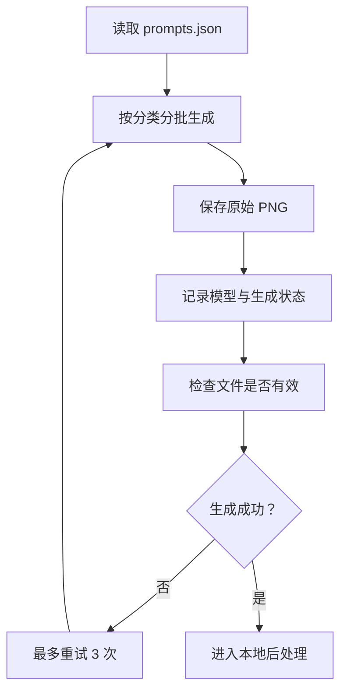

# Amaze Go 基础剪影库生产计划

## 1. 目标

为 Amaze Go 建立首批 100 个可复用基础剪影。AI 负责生成高分辨率黑白原图，后续二值化、连通区域提取、内部填洞、边缘平滑、点阵化、拓扑检查和报告输出全部由本地脚本完成。

最终交付包括：

- 100 张 AI 生成的原始 PNG；
- 100 条主题专用提示词与元数据；
- 自动清理后的实心黑白 PNG；
- 多种尺寸的点阵 JSON；
- 自动质量报告；
- 可供人工审核的预览图。

## 2. 主题清单

| 分类 | 数量 | 内容范围 |
| --- | ---: | --- |
| 几何符号 | 20 | 爱心、星星、月亮、闪电、盾牌等 |
| 动物 | 20 | 猫头、兔子头、鲸鱼、乌龟、蝴蝶等 |
| 植物自然 | 20 | 云朵、山峰、叶子、蘑菇、星球等 |
| 日常物品 | 20 | 火箭、城堡、礼物、相机、帆船等 |
| 食物 | 20 | 苹果、草莓、蛋糕、糖果、胡萝卜等 |

完整清单和每个主题的专用提示词保存在 `assets/silhouettes/prompts.json`。

## 3. 生成规范

每张 AI 原图必须满足：

- 画布为 1:1 正方形；
- 背景为纯白；
- 主体为纯黑实心剪影；
- 只有一个连通主体；
- 不包含眼睛、嘴巴、纹理和内部装饰；
- 不包含内部孔洞或镂空；
- 不包含断开的小部件；
- 轮廓紧凑、圆润、缩小后可辨识；
- 细小肢体、尾巴和枝条必须加粗；
- 主体占画布约 55% 至 80%；
- 四周保留约 8% 至 12% 安全边距。

## 4. AI 生成流程



推荐批次：

1. 先生成每类 2 张，共 10 张样本；
2. 运行完整后处理和点阵化；
3. 检查提示词是否稳定产生实心轮廓；
4. 再按每批 10 张生成剩余素材；
5. 每批结束立即运行本地质量检查。

## 5. 文件结构

```text
assets/silhouettes/
  prompts.json
  raw/
    geometric-01-heart.png
    animals-01-cat-head.png
  processed/
    geometric-01-heart.png
  grids/
    geometric-01-heart-16x24.json
  reports/
    report.json
    contact-sheet.png
scripts/
  create-silhouette-manifest.ts
  generate-silhouettes.ts
  process-silhouettes.py
```

## 6. AI 生成脚本职责

`generate-silhouettes.ts` 负责：

- 读取 `prompts.json`；
- 按分类、范围或指定 ID 选择任务；
- 调用 AI 图像生成命令；
- 将结果写入指定原图路径；
- 跳过已经存在且有效的文件；
- 每张图最多重试 3 次；
- 输出成功、失败和跳过统计；
- 支持断点续跑。

AI 脚本不负责清理图片或判定最终质量。

## 7. 本地后处理脚本职责

`process-silhouettes.py` 负责：

1. 加载原始 PNG；
2. 转为灰度；
3. 根据亮度自动二值化；
4. 自动判断主体是黑色还是白色；
5. 保留最大连通区域；
6. 填满所有内部孔洞；
7. 执行轻微闭运算，修复小裂缝；
8. 删除小型尖刺和噪点；
9. 将主体按安全边距居中缩放；
10. 输出 1024 × 1024 实心黑白 PNG；
11. 面积采样为多个点阵尺寸；
12. 对点阵再次执行最大连通区域和填洞；
13. 输出 JSON 和质量报告；
14. 生成审核用预览拼图。

## 8. 点阵尺寸

每张剪影默认尝试：

- 14 × 20；
- 16 × 22；
- 18 × 26；
- 20 × 28。

从中选择轮廓相似度、局部宽度和有效点数量最合适的版本用于关卡生成。

## 9. 自动质量门槛

| 指标 | 要求 |
| --- | --- |
| 原图可读取 | 必须 |
| 主体连通区域 | 1 个 |
| 内部孔洞 | 0 个 |
| 主体面积占比 | 35% 至 82% |
| 四周安全边距 | 每边至少 5% |
| 点阵连通区域 | 1 个 |
| 点阵内部孔洞 | 0 个 |
| 点阵有效点数量 | 80 至 420 |
| 一格宽区域占比 | 推荐低于 12% |
| 折线覆盖率 | 不低于 95% |
| 零长度折线 | 0 条 |
| 可解性 | 必须通过 |

不满足硬性条件的素材进入 `needs_revision` 状态，不参与正式关卡生成。

## 10. 人工审核重点

自动检查通过后，人工只需关注：

- 不看文件名时是否能识别轮廓；
- 缩略图是否仍像目标物体；
- 是否存在过细、过尖或不适合触控的局部；
- 是否与已有剪影过于相似；
- 生成的折线是否具有足够随机性和复杂度。

## 11. 执行命令

生成提示词清单：

```bash
npx tsx scripts/create-silhouette-manifest.ts
```

生成 AI 原图：

```bash
npm run silhouette:generate
```

只生成指定分类或范围：

```bash
npm run silhouette:generate -- --category animals --start 1 --end 10
```

运行本地后处理：

```bash
npm run silhouette:process
```

完成后重新生成正式关卡包：

```bash
npm run generate:levels
```

## 12. 验收标准

首批任务完成的定义：

- `prompts.json` 包含恰好 100 条记录；
- 每条记录具有唯一 ID、分类、中文名、提示词和输出路径；
- 100 张原始图片全部成功生成；
- 后处理脚本可以批量运行并支持断点续跑；
- 每张图片都产生清理图、点阵 JSON 和质量报告；
- 通过审核的剪影可以直接进入现有关卡生成器。

## 13. 当前开源 SVG 素材库

首批 100 关现已改用 Font Awesome 开源 SVG 剪影素材。素材存放于 `assets/silhouettes/source-svg/`，许可证副本为 `assets/silhouettes/FONT-AWESOME-LICENSE.txt`，原始清单为 `assets/silhouettes/source-manifest.csv`。

处理流程：

```text
100 个 SVG
→ rsvg-convert 栅格化
→ 最大连通区域
→ 填满内部孔洞
→ 自适应点阵尺寸
→ src/data/silhouette-boards.json
→ 随机折线分割
→ src/data/generated-levels.json
```

重新生成命令：

```bash
python3 scripts/convert-svg-silhouettes.py
npm run generate:levels
```
